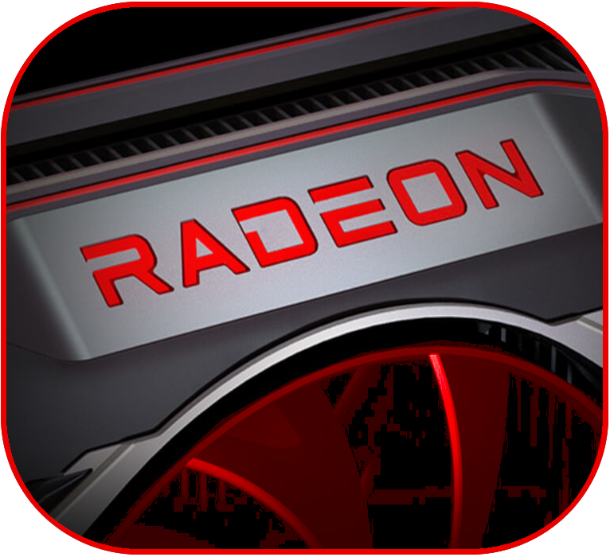
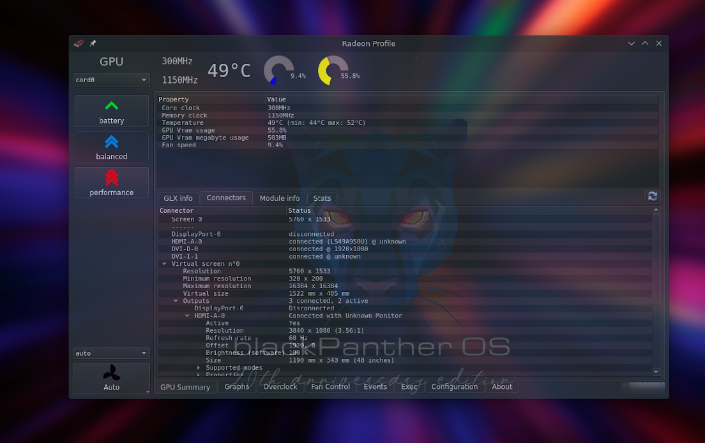

# Radeon-Profile-Qt6
Simple Qt6 application to read current clocks of ATi Radeon cards (xf86-video-ati, xf86-video-amdgpu driver).

# Requires: 
(Qt6 version rewrite in progress!)
Install Qt5 version and run radeon-profile-daemon (https://github.com/marazmista/radeon-profile-daemon) for using this app as normal user. Otherwise app need to be run with root privilages for changing power profiles (and clocks readings sometimes). You can add `username ALL = NOPASSWD: /usr/bin/radeon-profile` to your `/etc/sudoers`. Here is tip for run app as normal user but involves change permissions to system files: http://bit.ly/1dvQMhS

# Functionality

* Monitoring of basic GPU parameters (frequencies, voltages, usage, temperature, fan speed)
* DPM profiles and power levels
* Fan control (HD 7000+), definition of multiple custom curves or fixed speed
* Overclocking (amdgpu) (Wattman, Overdrive, PowerPlay etc)
* Per app profiles/Event definitions (i.e. change fan profile when temp above defined or set DPM to high when selected binary executed)
* Define binaries to run with set of environment variablees (i.e. GALLIUM_HUD, MESA, LIBGL etc)

# Dependencies

* Qt 6 >= (qt6-base and qt6-charts) 
 /On Redhat based distro: `qt6-qtbase-devel qt6-qtcharts-devel`
 /On Debian/Ubuntu: `qt6-default libqt5charts6-dev`/
* libxrandr
* libdrm >= 2.6.116 (for amdgpu, more recent, the better)
* recent kernel (for amdgpu 4.12<=, more recent, the better)
* radeon card

For full functionality:
* glxinfo - info about OpenGL, mesa
* xdriinfo - driver info
* xrandr - connected displays

# Install on blackPanther OS
Automatic driver, daemon, application install method:
```
installing radeon-profile
```
# Other Installation method
### Ubuntu 
Available Qt5 version for Ubuntu from PPA [stable](https://launchpad.net/~radeon-profile/+archive/ubuntu/stable) and [git develop](https://launchpad.net/~radeon-profile/+archive/ubuntu/radeon-profile) repository

Add in terminal commands:

* For git ppa: 
```
sudo add-apt-repository ppa:radeon-profile/radeon-profile
```
* For stable ppa: 
```
sudo add-apt-repository ppa:radeon-profile/stable
```
* Then run commands:
```
sudo apt update
sudo apt install radeon-profile
```
# Build from Source

```
git clone https://github.com/blackPantherOS/radeon-profile-qt6.git
cd radeon-profile/radeon-profile
qmake-qt6
make 
```

The resulting binary is `./target/radeon-profile`

For Ubuntu 2x.xx, qt6-charts isn't available:
* Use `qtchooser -l` to list available profiles
* Use `qmake -qt=[profile from qtchooser]` to specify Qt root or download and install a Qt bundle from https://www.qt.io/download-open-source/#section-2
* Make a `qt6opt.conf` in `/usr/lib/x86_64-linux-gnu/qtchooser/` containing:

```
/opt/Qt6.6.0/6.6.0/gcc_64/bin
/opt/Qt6.6.0/6.6.0
```
### Arch Linux 
* AUR Qt5 package : https://aur.archlinux.org/packages/radeon-profile-git/
* System daemon AUR package: https://aur.archlinux.org/packages/radeon-profile-daemon-git/
# Old Links

* System daemon: https://github.com/marazmista/radeon-profile-daemon
* Sort of official thread: http://phoronix.com/forums/showthread.php?83602-radeon-profile-tool-for-changing-profiles-and-monitoring-some-GPU-parameters

# New icon
 
* New icon plan created by Charles K Barcza <kbarcza@blackpanther.hu> 


# Qt6 Screenshot

Main screen

[More Qt6 screenshots](extra/)
[More Qt5 screenshots](http://imgur.com/a/DMRr9)
